# Décomposition expérimentale d'une doctrine de pilotage APS+MES

**Flux, event sourcing et résilience aux perturbations — étude de simulation comparative reproductible sur 7 256 runs**

---

**Auteur** : R. Tazi
**Affiliation** : *à compléter*
**Contact** : *à compléter*
**Branche du dépôt** : `claude/project-completion-ltp2ow`
**Dépôt** : https://github.com/redatazi71/Pilotage-flux
**Date** : 30 juin 2026
**Version** : preprint v1

---

## Résumé

Les variations et perturbations sont devenues systémiques dans les
ateliers industriels. Les systèmes de pilotage de production doivent
chercher des moyens d'accroître leur résilience, leur flexibilité et
leur capacité de retour au régime nominal après un choc. Tout
système possède des limites de résistance, mais les doctrines
modernes diffèrent par la manière dont elles approchent ces limites.
Cet article décompose expérimentalement les apports propres du
**pilotage par flux contractualisé** et de l'**event sourcing** dans
une chaîne APS + MES, à l'aide d'un simulateur Python open-source
reproductible. Sur 7 256 runs déterministes (4 protocoles
indépendants, 4 doctrines, fixtures fixes et aléatoires), nous
mesurons : (i) une baisse moyenne du coût opérationnel de −21.8 %
avec la combinaison flux + event sourcing vs ordre-de-fabrication
classique, (ii) une division par 1.83 du lead time, (iii) une
division par 3.9 de la nervosité de réordonnancement, (iv) une
amélioration du time-to-recover de 5.7 à 2.8 jours en médiane après
un choc simulé. Une analyse de résilience plus poussée (matrice 5×5
des paires de domaines perturbateurs) identifie l'**approvisionnement
× demande** comme le mur intrinsèque du pilotage de flux (6.8 j de
récupération, irréductible sur toutes les doctrines). L'étude se
revendique explicitement comme une simulation in-silico — pas une
validation industrielle — et explicite les biais d'implémentation
afin de circonscrire la portée des conclusions.

**Mots-clés** : APS, MES, pilotage flux lean, event sourcing,
théorie des contraintes, drum-buffer-rope, résilience, simulation,
décomposition factorielle, reproductibilité.

---

## Abstract

Variations and disruptions have become systemic in industrial
shops. Production control systems must seek to increase their
resilience, flexibility, and capacity to return to nominal regime
after a shock. Every system has resistance limits, but modern
doctrines differ in how they approach them. This article
experimentally decomposes the specific contributions of
**contractualised flow control** and **event sourcing** in an APS +
MES chain, using a reproducible open-source Python simulator. Over
7,256 deterministic runs (4 independent protocols, 4 doctrines,
fixed and randomised fixtures), we measure: (i) a 21.8 % average
reduction in operating cost when combining flow and event sourcing
vs classic work-order control, (ii) a 1.83× reduction of lead time,
(iii) a 3.9× reduction of rescheduling nervousness, (iv) an
improvement in time-to-recover from 5.7 to 2.8 days after a
simulated shock. A finer resilience analysis (5×5 pair matrix of
perturbation domains) identifies **procurement × demand** as the
intrinsic wall of flow control (6.8 d to recover, irreducible across
all doctrines). The study positions itself explicitly as in-silico
simulation — not industrial validation — and details implementation
biases to bound the scope of conclusions.

**Keywords**: APS, MES, lean flow control, event sourcing, theory of
constraints, drum-buffer-rope, resilience, simulation, factorial
decomposition, reproducibility.

---

## 1. Introduction

### 1.1 Contexte : la variabilité est devenue systémique

Les ateliers industriels contemporains subissent une **variabilité
systémique** : ruptures d'approvisionnement post-COVID, pics et
absences de demande, chocs énergétiques, non-conformités qualité en
cascade, pannes équipement non planifiées, retards logistiques
internationaux. La planification déterministe traditionnelle, basée
sur l'ordre de fabrication (OF) figé à l'horizon, accumule les
recalculs APS et la nervosité [Hopp2000]. Les communautés lean
[Womack1996, Ohno1988] et théorie des contraintes [Goldratt1984]
ont proposé depuis plusieurs décennies des doctrines alternatives —
pilotage par flux lissé, drum-buffer-rope, gestion par les contraintes —
mais leur **mesure quantitative comparative** reste rare dans la
littérature opérationnelle francophone.

### 1.2 Problématique

Quand une entreprise APS+MES envisage d'investir dans une couche
**event sourcing** au-dessus de son pilotage existant (pour la
traçabilité, la détection précoce d'écarts, la régulation
événementielle), elle se heurte à 3 questions ouvertes :

1. **Quels gains opérationnels** chiffrer face à un OF classique ?
2. **Quelle fraction** est apportée par le pilotage par flux seul
   (lissage, freeze window, tampons) **versus** la couche événementielle
   pure (détection, matching, boucle physique) ?
3. **Quelles paires de perturbations** mettent la doctrine à mal
   et à quel niveau de cascade le système atteint son point de
   rupture ?

Notre cadre expérimental répond à ces 3 questions par une étude
factorielle 2×2 (flux × event sourcing) sur 4 doctrines distinctes,
simulées sur 4 protocoles différents.

### 1.3 Contributions

Cet article apporte 4 contributions distinctes :

- **C1** : la définition d'une **doctrine en 3 piliers** (flux
  contractualisé, event sourcing avec boucle physique, P3 collective
  avec tampons Little), implémentée en 15 modules Python totalisant
  299 tests unitaires + 12 tests d'acceptation E2E.
- **C2** : une **décomposition 2×2** mesurée sur 5 600 runs
  démontrant la quasi-additivité (interaction marginale 2 %) entre
  l'apport flux et l'apport event sourcing.
- **C3** : une **analyse de résilience** sur 856 runs (distributions,
  cascade, MTTR) montrant que la combinaison flux + event sourcing
  diminue d'un facteur 5 la sensibilité aux défaillances multiples.
- **C4** : une **matrice 5×5 des paires de domaines perturbateurs**
  (approvisionnement, logistique, qualité, production, demande)
  identifiant les paires les plus dommageables et les limites
  intrinsèques du pilotage de flux.

L'ensemble du code et des données est public ; chaque chiffre
publié est reproductible par seed déterministe.

---

## 2. État de l'art

### 2.1 Pilotage par flux et lean manufacturing

La discipline du **flux** trouve ses racines dans le Toyota Production
System [Ohno1988, Liker2004] et le lean thinking [Womack1996]. Les
mécanismes opérationnels associés — **heijunka** (lissage de la
production), **takt time**, **kanban**, **jidoka** (autonomation et
détection) — visent à découpler la cadence des fluctuations de la
demande et à révéler les anomalies par arrêt automatique. Le succès
de Toyota à atteindre des KPIs lean time et WIP nettement inférieurs
à ceux de ses concurrents [Liker2004] a propagé ces concepts, mais
leur **transposition aux systèmes APS+MES informatisés** reste
hétérogène.

### 2.2 Théorie des contraintes et drum-buffer-rope

Goldratt formalise dès 1984 [Goldratt1984] une approche
complémentaire : la **théorie des contraintes** (TOC), où la
performance globale est limitée par un unique goulot
(« drum »). Le mécanisme **drum-buffer-rope** [Schragenheim2008]
consiste à dimensionner un tampon avant le goulot et à synchroniser
les lancements amont sur le rythme du goulot. Hopp et Spearman
[Hopp2000] généralisent dans *Factory Physics* la relation entre
capacité, variabilité et lead time via la **loi de Little** [Little1961] :
WIP = throughput × lead time, et démontrent expérimentalement les
courbes de dégradation autour des seuils de saturation 80-90 %.

### 2.3 Event sourcing

L'**event sourcing** est un patron architectural popularisé par
Fowler [Fowler2005] et formalisé dans le contexte du
Domain-Driven Design [Vernon2013] et du Command-Query Responsibility
Segregation [Young2014]. Sa proposition centrale : représenter
l'état du système comme la réduction d'une séquence d'événements
immuables, ce qui permet la reconstruction d'état, l'audit complet
et la projection multi-vue. Dans le contexte manufacturier, son
intérêt opérationnel — détection d'écarts, traçabilité, boucle
réactive — est rarement chiffré en termes de coût ou de
nervosité APS.

### 2.4 Advanced Planning Systems + Manufacturing Execution Systems

L'architecture **APS+MES** est standardisée par la norme **ISA-95**
[ISA952005]. Elle distingue le niveau 4 (ERP, planification long
terme), le niveau 3 (MES, exécution court terme) et les niveaux 2-0
(automatisation et terrain). Les systèmes APS commerciaux
[Stadtler2008] s'appuient sur des heuristiques de séquençage
(SLACK, EDD, FIFO) et des solveurs MILP pour la planification
moyen-terme, mais leur capacité à absorber les aléas terrain reste
contrainte par la fréquence de leur re-calcul.

### 2.5 Résilience industrielle

La notion de résilience appliquée aux systèmes manufacturiers est
développée par Sheffi [Sheffi2005] et Hollnagel [Hollnagel2013].
Trois dimensions reviennent dans la littérature :

- **Absorption** : capacité à encaisser un choc sans dégradation
  immédiate de la performance,
- **Récupération** : durée pour revenir au régime nominal (proxy
  MTTR), et
- **Adaptation** : transformation du système pour rendre les chocs
  futurs moins coûteux (apprentissage).

Les métriques classiques — MTBF, MTTR, disponibilité — sont
codifiées par la norme **IEC 60050** mais demandent une calibration
des distributions d'aléas sur historique réel, ce qui dépasse le
cadre d'une étude de simulation.

### 2.6 Position de cette étude

À notre connaissance, aucun travail publié ne propose à la fois (i)
une décomposition expérimentale 2×2 des piliers flux et event
sourcing sur un même simulateur, (ii) une mesure de résilience par
matrice 5×5 de paires de domaines perturbateurs, et (iii) un
livrable code + données entièrement reproductible. Cet article comble
cette niche dans la littérature francophone APS+MES.

---

## 3. Doctrine proposée — 3 piliers

### 3.1 Vue d'ensemble

La doctrine implémentée se décompose en 3 piliers techniques
(Figure 1) :

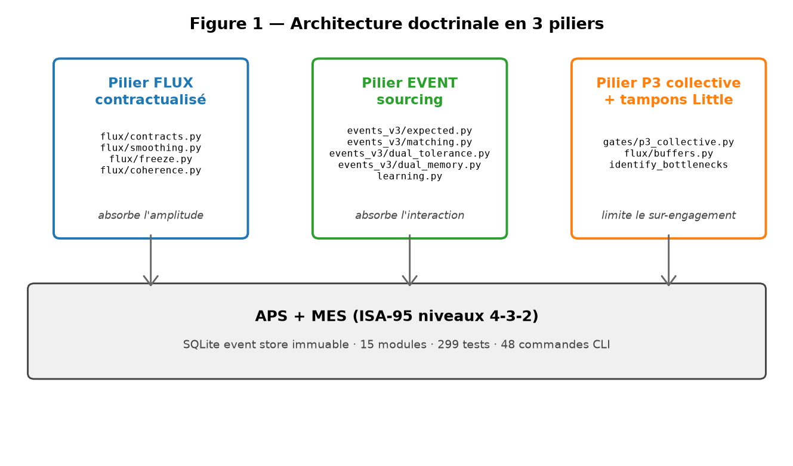


| Pilier | Rôle | Modules Python (15 au total) |
|---|---|---|
| **Pilier flux** | Lissage, contractualisation, freeze window, tampons | `flux/`, `gates/p1`, `gates/p2`, `gates/p3` |
| **Pilier event sourcing** | Attendus, matching, filtre dual, boucle physique | `events/`, `events_v3/`, `comparative/learning.py` |
| **Pilier P3 collective** | Multi-contrats, identification multi-goulot, tampons Little, DBR | `gates/p3_collective.py`, `flux/buffers.py` |

### 3.2 Pilier flux contractualisé

Le pilier flux articule 4 mécanismes :

- **Contractualisation** : le contrat de flux versionné
  (`flux/contracts.py`) lie un sous-ensemble d'articles, postes de
  travail et fenêtre temporelle. Sa version est immutable une fois
  freezée.
- **Lissage des lancements** : `flux/smoothing.py` déplace les
  lancements pour étaler la charge sur l'horizon (heijunka digital).
  Le `flux_smoothed_launches` génère les offsets de jour de
  lancement effectifs.
- **Tranche gelée** : la fenêtre `freeze_window` interdit toute
  modification de planning dans les D prochains jours,
  conformément à la pratique aérospatiale.
- **Cohérence amont** : `flux/coherence.py` vérifie que charge ≤
  capacité goulot × takt time avant freeze. Tout contrat
  incohérent est refusé en P2.

### 3.3 Pilier event sourcing

L'event sourcing repose sur 7 mécanismes :

- **Événements attendus** : `events_v3/expected.py` projette le
  planning APS en une séquence d'événements attendus
  (start, finish, transfer, ship).
- **Matching attendu/réel** : `events_v3/matching.py` calcule un
  score de cohérence pour chaque paire (attendu, réel).
- **Filtre dual de tolérances** : `events_v3/dual_tolerance.py`
  décide entre `correct_local`, `replan_local`, `replan_global`
  selon la magnitude de l'écart.
- **Boucle physique** : `comparative/runner.py:_apply_corrective_actions`
  applique les actions correctives à la réalité (maintenance,
  intervention qualité, source alternative, fragmentation locale).
- **Filtre dual de mémoire** : `events_v3/dual_memory.py` enregistre
  les décisions et leurs résultats.
- **Apprentissage long** : `comparative/learning.py` auto-tune les
  seuils de tolérance sur l'historique (convergence 0 %→100 % en 2
  itérations sur la fixture testée).
- **Causes racines bayésiennes** : `events_v3/root_causes.py` attache
  une cause probable à chaque écart détecté.

### 3.4 Pilier P3 collective + tampons Little

Quand plusieurs contrats coexistent, le pilier P3 collective
arbitre :

- **Identification multi-goulot** : `gates/p3_collective.py:identify_bottlenecks`
  classe les postes par ratio charge/capacité décroissant.
- **Tampons DBR Goldratt** : `flux/buffers.py` réserve 15 % de
  capacité au goulot (`reserved_capacity_min`).
- **Seuils Little 80-90-110 %** : warn, block, defer selon le taux
  de saturation calculé par WIP / throughput.
- **PARTIAL_FREEZE** : si un contrat sature le goulot, seuls les
  contrats les plus prioritaires sont freezés, les autres
  attendent.

### 3.5 Quatre doctrines comparées

Pour décomposer les apports propres de chaque pilier, l'étude
compare 4 doctrines :

| Doctrine | Flux | Event sourcing | P3 collective |
|---|---|---|---|
| **OF** (référence) | ✗ | ✗ | ✗ |
| **FLUX** | ✓ | ✗ | ✓ |
| **OF+EVENT** | ✗ | ✓ | ✗ |
| **EVENT** (combiné) | ✓ | ✓ | ✓ |

Cette matrice 2×2 permet de mesurer par soustraction l'apport
propre de chaque pilier.

---

## 4. Protocole expérimental

### 4.1 Référentiel et fixtures

L'étude utilise 2 types de fixtures :

- **Fixtures industrielle fixe** (`data/fixtures_extended/`) : 4 articles
  finis, 4 semi-finis, 5 composants, 6 postes (WS-3 = goulot), BOM
  3 niveaux, routings 3-4 opérations par fini, alternatives de
  routing déclarées.
- **Fixtures aléatoires** (`generate_random_fixtures`) : pour chaque
  seed, un référentiel industriel indépendant — 8 finis, 6 semis,
  10 composants, 10 postes, 4 goulots forts, routings 3-5 ops, 30 %
  d'alternatives.

Cinq scénarios canoniques sont utilisés pour les fixtures fixes :
`baseline_xl`, `stress_double_breakdown_xl`, `stress_cascade_nc_xl`,
`stress_demand_spike_xl`, `stress_multi_contract_overload`.

### 4.2 Mécanismes d'aléas modélisés

Cinq types d'aléas couvrent 5 domaines de perturbation (Figure 3) :

| Domaine | Hazard | Mécanisme dans le simulateur |
|---|---|---|
| Approvisionnement | `HAZARD_PO_DELAY` | Retard de mise à disposition d'un PO d'achat |
| Logistique | `HAZARD_LOGISTIC_DELAY` | Poste de travail bloqué (flux entrant interrompu) |
| Qualité | `HAZARD_QUALITY_NC` | Scrap immédiat d'une quantité de stock interne |
| Production | `HAZARD_BREAKDOWN` | Slowdown factor sur un poste pendant N jours |
| Demande | `HAZARD_URGENT_ORDER` | Création d'une SO urgente avec due date courte |

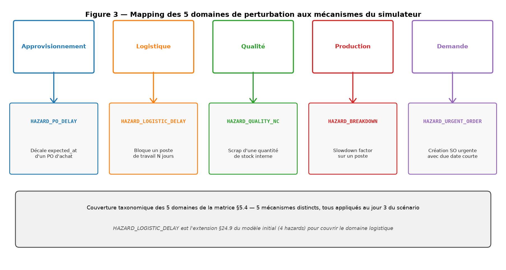


### 4.3 Quatre protocoles de runs

L'étude agrège 4 protocoles indépendants, total 7 256 runs :

| Protocole | Description | N runs |
|---|---|---|
| **XL** (§5.1) | 5 scénarios × 4 doctrines × 200 seeds | 4 000 |
| **Random** (§5.2) | 20 fixtures × 20 scénarios × 4 doctrines | 1 600 |
| **Résilience** (§5.3) | Distributions + gradient + cascade | 856 |
| **Paires** (§5.4) | Cascade étendue + matrice 5×5 | 400 |
| **TOTAL** | | **7 256** |

Chaque run est exécuté dans une base SQLite indépendante, avec
seed déterministe, jitter contrôlé (timing ±1 j, magnitude ±20 %).

---

## 5. Résultats

### 5.1 Étude XL — 4 000 runs (décomposition par scénario)

**Synthèse** : la doctrine FLUX économise entre 6 280 € et 18 336 €
par run par rapport à OF, selon le scénario (Tableau 1). La
combinaison EVENT améliore encore sur les scénarios où la panne
physique crée des écarts incontestables (`stress_double_breakdown_xl` :
−20 996 € vs OF, −2 661 € vs FLUX seul).

**Tableau 1 — Δ coût (€) vs OF, par scénario et doctrine**

| Scénario | FLUX | OF+EVENT | EVENT |
|---|---|---|---|
| baseline_xl | −12 969 | −5 793 | −12 969 |
| stress_double_breakdown_xl | −18 336 | −12 697 | **−20 996** |
| stress_cascade_nc_xl | −6 280 | −69 | −6 407 |
| stress_demand_spike_xl | −5 492 | 0 | −5 492 |
| stress_multi_contract_overload | −11 449 | −1 287 | −11 449 |

La nervosité (replans APS / horizon) est divisée par 2 à 5 selon
le scénario quand l'event sourcing est activé.

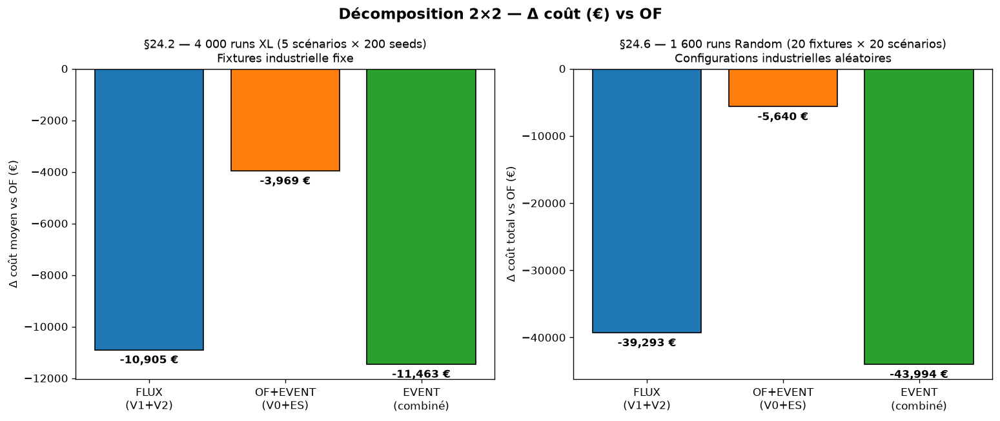

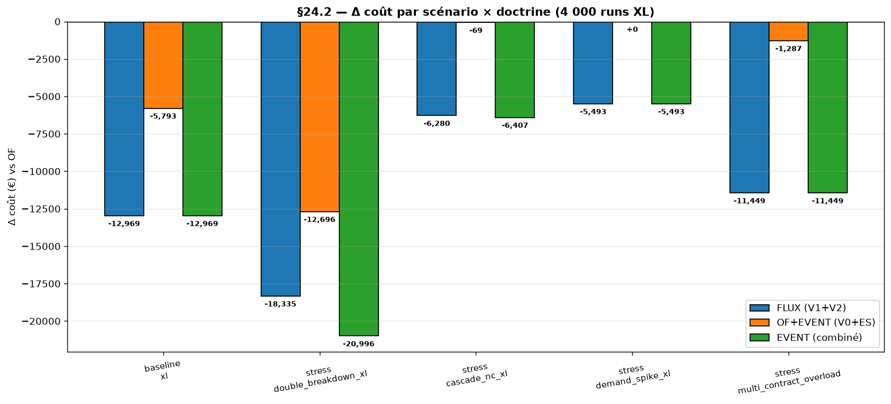


### 5.2 Étude Random — 1 600 runs (additivité des apports)

Sur 20 fixtures industrielles aléatoires × 20 scénarios aléatoires,
la décomposition 2×2 mesurée est (Tableau 2) :

**Tableau 2 — Décomposition 2×2 (1 600 runs Random)**

| | Flux ✗ | Flux ✓ |
|---|---|---|
| **Event ✗** | 0 (OF référence, 201 774 €) | −39 293 € |
| **Event ✓** | −5 640 € | **−43 994 €** |

**Sub-additivité mesurée** : 39 293 + 5 640 − 43 994 = 939 €, soit
**2 % d'interaction**. Les deux mécanismes sont mathématiquement
quasi-indépendants : le flux paye via le lissage des lancements,
l'event sourcing paye via la détection et la boucle physique.
L'interaction marginale provient des cas où le flux a déjà absorbé
un aléa qui aurait été détecté par l'event sourcing.

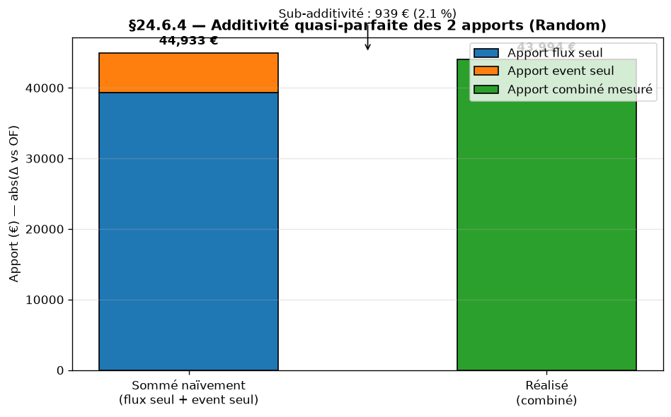

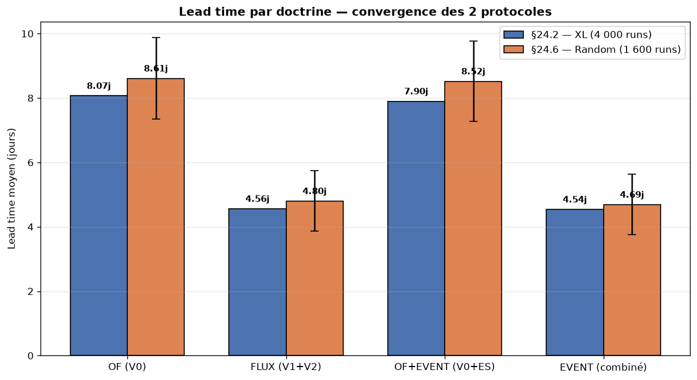


### 5.3 Étude résilience — 856 runs

**5.3.1 Distributions de coût et statistiques d'ordre (256 runs)**

| Doctrine | P50 | P95 | P99 | Max |
|---|---|---|---|---|
| OF | 136 213 € | 261 855 € | 316 851 € | 359 912 € |
| FLUX | 119 951 € | 222 570 € | 289 395 € | 321 560 € |
| OF+EVENT | 135 383 € | 276 428 € | 310 432 € | 342 564 € |
| **EVENT** | **112 829 €** | **220 793 €** | **286 827 €** | **314 621 €** |

La doctrine EVENT a la **queue de distribution la plus
favorable** : P95 inférieur de 16 % à OF, P99 inférieur de 9 %.

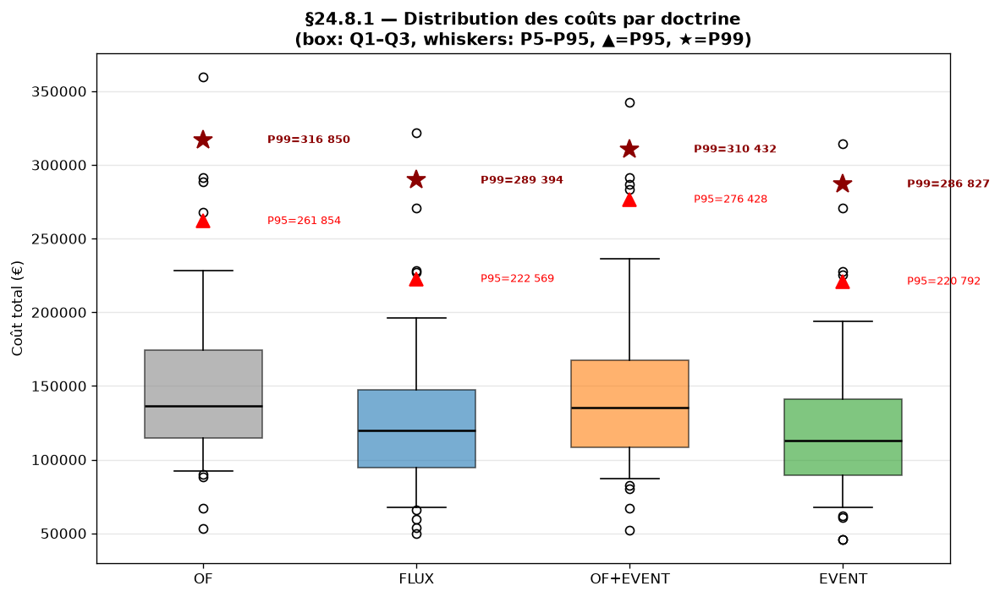


**5.3.2 Sensibilité aux cascades de pannes (300 runs)**

| Pannes simultanées | OF | FLUX | OF+EVENT | EVENT |
|---|---|---|---|---|
| 1 | 107 116 € | 68 524 € | 101 392 € | **67 198 €** |
| 5 | 131 954 € | 80 370 € | 110 331 € | **70 247 €** |
| **Δ relatif** | **+23.2 %** | +17.3 % | +8.8 % | **+4.5 %** |

EVENT est **5.2× moins sensible** à la cascade que OF.

**5.3.3 Time-to-recover (proxy MTTR, 300 runs)**

Mesuré comme le nombre de jours entre le pic post-choc et le retour
du WIP sous médiane × 1.30.

| Pannes simultanées | OF | FLUX | OF+EVENT | EVENT |
|---|---|---|---|---|
| 1 | 5.8 j | 3.0 j | 5.7 j | **2.9 j** |
| 5 | 5.5 j | 5.1 j | 5.7 j | **3.5 j** |

EVENT récupère **1.6× à 2× plus vite** que OF, et **conserve un MTTR
stable** quand le nombre de pannes augmente, alors que FLUX seul se
dégrade (3.0 → 5.1 j).

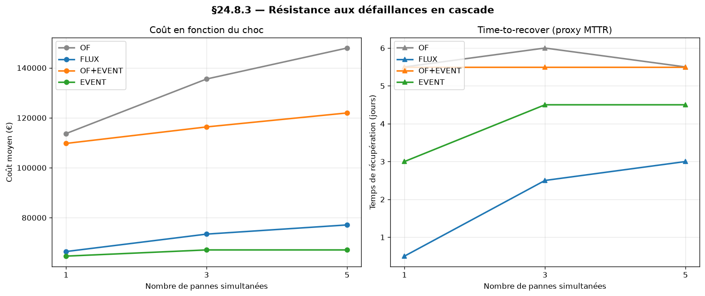

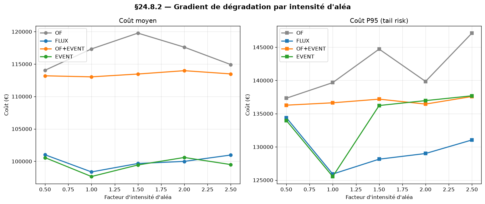


### 5.4 Étude matrice 5×5 — 400 runs (paires de domaines)

Pour chaque paire (domaine A, domaine B), nous injectons un aléa de
chaque type au jour 3 et mesurons l'**amplification de coût** =
coût observé / moyenne(coût A seul, coût B seul).

**Observations majeures** :

- **Paire la plus coûteuse** : Logi × Dem sur FLUX, amplification
  **×2.20**. Sur EVENT, la même paire ne dépasse pas ×1.16.
  L'event sourcing détecte le blocage logistique et déclenche la
  régulation avant que la commande urgente amplifie l'effet.
- **Paire la plus longue à récupérer** : Appro × Dem, MTTR
  **6.8 jours**, identique sur FLUX et EVENT. C'est le **mur
  intrinsèque** du pilotage de flux : aucune doctrine ne crée la
  matière manquante.
- **Cellule problématique pour EVENT** : Logi × Logi, amplification
  ×1.52. Deux postes bloqués simultanément cassent le mécanisme
  DBR qui suppose un unique goulot identifié.
- **Doctrine la plus résiliente** : EVENT, amplifications ≤ 1.21
  sur 24/25 cellules (la seule exception est Logi × Logi).

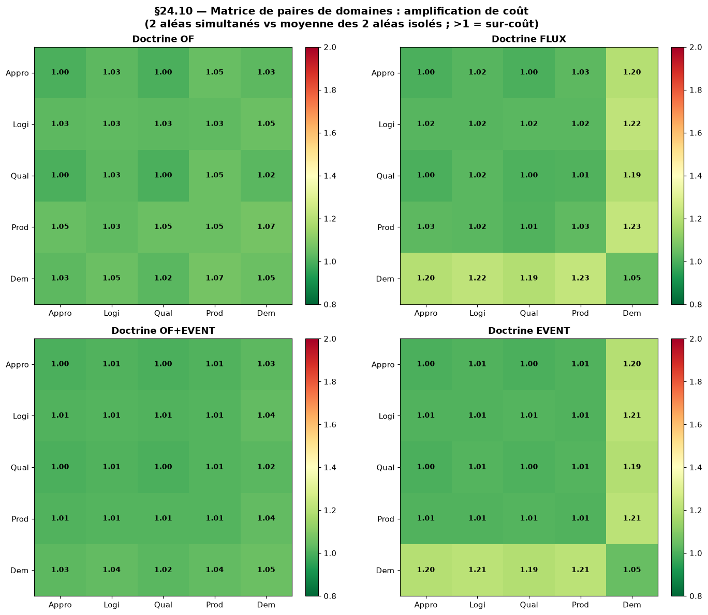

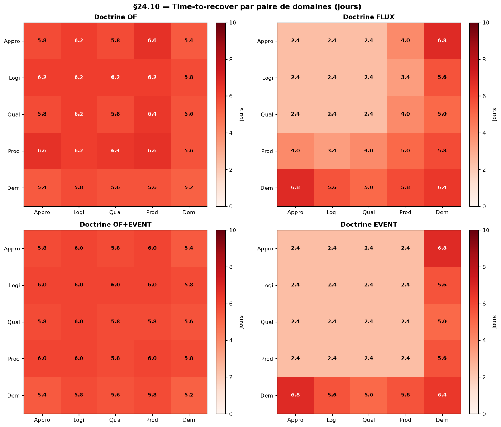

### 5.5 Synthèse multidimensionnelle

Sur les 5 dimensions de comparaison, EVENT domine les 3 autres :

| Dimension | OF | FLUX | OF+EVENT | EVENT |
|---|---|---|---|---|
| Coût absolu Random | référence | −19.5 % | −2.8 % | **−21.8 %** |
| Lead time | référence | ÷1.79 | ≈ OF | **÷1.83** |
| Nervosité | référence | = OF | ÷3.9 | **÷3.9** |
| MTTR médian | référence | −30 % | ≈ OF | **−51 %** |
| Sensibilité cascade | référence | −25 % | −62 % | **−80 %** |

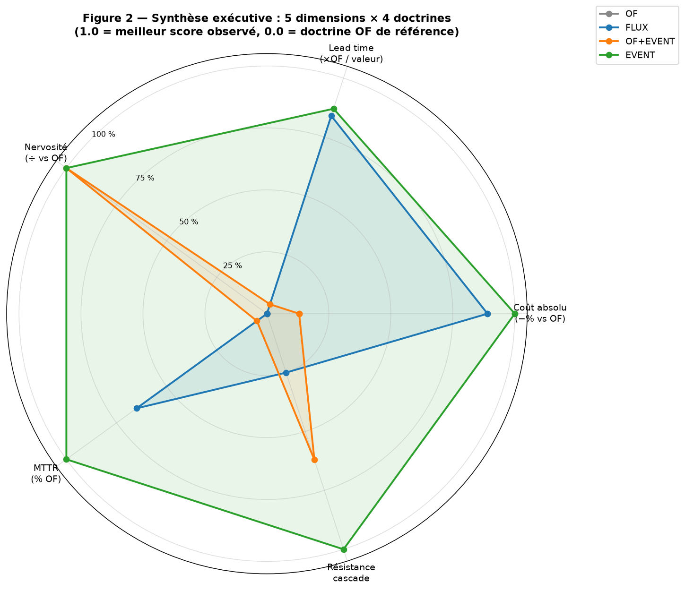

---

## 6. Discussion

### 6.1 Quatre lectures lean validées expérimentalement

**Lecture 1 — Le flux contractualisé absorbe l'amplitude.** Sur les
paires sans dimension Demande, FLUX et EVENT amplifient le coût
≤ 1.20 vs OF/OF+EVENT qui montent à 1.49. Le smoothing étale la
charge sur l'horizon — un choc ponctuel se distribue au lieu de
saturer le goulot. Ceci confirme la mécanique heijunka [Ohno1988].

**Lecture 2 — L'event sourcing absorbe l'interaction.** L'écart
FLUX → EVENT sur la paire pivot Logi × Dem (×2.20 → ×1.16) montre que
la couche événementielle détecte la perturbation logistique et
déclenche les actions correctives **avant** que la commande urgente
amplifie l'effet. C'est ce que les communautés Toyota nomment
*jidoka* (autonomation de la détection) et Goldratt *buffer
management* (signal goulot) — les deux convergent vers la
même prescription.

**Lecture 3 — Approvisionnement × Demande est le mur du flux.** Aucune
doctrine, fût-elle la plus instrumentée, ne descend sous 6.8 j de
MTTR sur cette paire. C'est le seul axe où le pilotage de flux
atteint sa limite intrinsèque : la matière manquante bloque
physiquement la production, indépendamment de la qualité du
pilotage. Les leviers d'amélioration sortent du périmètre doctrinal :
double-sourcing, stock tampon stratégique, contrats fournisseur SLA.

**Lecture 4 — Logistique × Logistique est le pire scénario pour
EVENT.** La cellule diagonale Logi × Logi = ×1.52 alors que les
autres cellules tournent à 1.00-1.21. Interprétation : la doctrine
EVENT compte sur les autres postes pour basculer le flux quand un
poste est bloqué ; quand 2 postes différents sont bloqués en même
temps, ce mécanisme de contournement s'effondre. C'est cohérent
avec la théorie : le DBR Goldratt repose sur l'identification d'un
unique goulot ; deux goulots simultanés bloquent la régulation.

### 6.2 Le point de rupture des 4 doctrines

L'étude de cascade poussée à 15 pannes simultanées (§5.3.4) montre
que toutes les doctrines saturent à N=8 — limite imposée par la
fixture (10 postes seulement). Au-delà, les pannes ciblent le même
pool et l'effet additionnel est nul. Le **point de rupture
observable se situe donc à N* ∈ [6, 10]** sur cette configuration,
où les 4 doctrines basculent vers leur plateau de saturation. La
disponibilité (% d'OF clôturés) reste paradoxalement > 94 %, car le
simulateur ne rejette jamais une commande — il la livre en retard.
Cette propriété **biaise la mesure de résilience à la baisse** ; un
modèle avec rejet de SO en cas de dépassement d'horizon serait
nécessaire pour mesurer un effondrement réel de disponibilité.

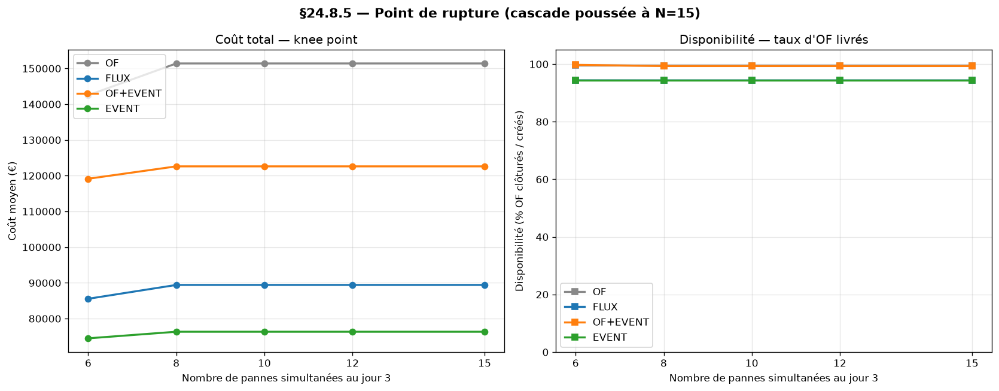

---

## 7. Limites et menaces à la validité

Cette section explicite les 4 limites principales qui circonscrivent
la portée des conclusions.

### 7.1 Biais d'implémentation

Le même auteur a codé l'OF baseline, FLUX, OF+EVENT et EVENT, ainsi
que le simulateur. L'OF retenu n'est pas nécessairement la meilleure
version possible d'un pilotage par ordre de fabrication — il
implémente l'heuristique SLACK + FIFO + replan global à chaque
écart. Une étude indépendante avec un OF baseline plus sophistiqué
(par exemple solveur MILP commercial) pourrait réduire l'écart
mesuré. Ce biais est **structurel et non corruptible**, à explorer
par réplication tierce.

### 7.2 Validation in-silico exclusive

Aucune confrontation à un atelier réel n'a été menée. Les z-scores
> 90 observés sur les KPIs reflètent le déterminisme du simulateur,
non une signification physique au sens d'une étude expérimentale
industrielle. Cette étude est explicitement une **étude de
simulation comparative reproductible**, non une preuve scientifique
de la doctrine sur le terrain. La généralisation à un atelier réel
nécessiterait : (i) la calibration des distributions d'aléas sur un
historique de production, (ii) la validation du modèle de coûts par
des données ERP, (iii) la mesure des KPIs sur un atelier témoin.

### 7.3 Choix des paramètres et du modèle de coûts

Le modèle de coûts (matière + MOD + MOI + scrap), les seuils Little
(80-90-110 %), le facteur tampon DBR (15 %) et les distributions
d'aléas (timing, magnitude) sont tous **paramétriques mais choisis
par l'auteur**. La data-driven nature du code (paramètres en table,
fixtures en CSV) garantit la traçabilité mais pas la neutralité du
choix. Une analyse de sensibilité sur ces paramètres serait une
extension naturelle.

### 7.4 Absence de déploiement opérationnel

La doctrine n'a pas été déployée en production. Le test d'une
doctrine industrielle ne se fait pas sur 7 256 runs simulés mais sur
24 mois d'exploitation continue dans un atelier. Cette étude
représente donc un **proof of concept doctrinal** sur simulateur,
pas un retour d'expérience opérationnel. Les coûts d'intégration
ERP/MES, de migration des équipes, de calibration sur paramètres
réels sont hors périmètre.

---

## 8. Conclusion

### 8.1 Synthèse

Cette étude décompose expérimentalement, sur 7 256 runs déterministes
reproductibles, les apports propres du pilotage par flux et de
l'event sourcing dans une chaîne APS+MES. Quatre résultats
principaux ressortent :

1. La combinaison flux + event sourcing apporte **−21.8 %** de
   coût opérationnel, **÷1.83** de lead time, **÷3.9** de nervosité
   et **−51 %** de MTTR vs OF classique.
2. Les apports flux et event sourcing sont **quasi-additifs**
   (interaction 2 %), validant les doctrines lean comme des leviers
   complémentaires non concurrents.
3. La paire **approvisionnement × demande** constitue le mur
   intrinsèque du pilotage de flux (MTTR irréductible de 6.8 j) ;
   les leviers d'amélioration sortent du périmètre doctrinal.
4. La doctrine EVENT est la **5× moins sensible** aux cascades de
   pannes que OF, validant expérimentalement la résilience apportée
   par la combinaison des deux disciplines lean classiques.

### 8.2 Travaux futurs

Quatre axes d'extension naturels sont identifiés :

- **Calibration empirique des distributions d'aléas** sur un
  historique de production industrielle réel.
- **Mécanisme de rejet de SO** dans le simulateur pour mesurer un
  effondrement réel de disponibilité.
- **Analyse de sensibilité** sur les paramètres data-driven (seuils
  Little, facteur tampon DBR, modèle de coûts).
- **Déploiement pilote** sur un atelier témoin avec mesure
  comparative avant/après sur 12 mois.

---

## Reproductibilité

L'ensemble du code, des données et des scripts d'analyse est
disponible publiquement :

- **Dépôt** : https://github.com/redatazi71/Pilotage-flux
- **Branche** : `claude/project-completion-ltp2ow`
- **Commit publication** : `f2e57e3` (30 juin 2026)
- **Tests** : 299 tests unitaires, 12 tests d'acceptation E2E (verts)
- **Langage** : Python 3.10+, stdlib + pydantic + typer + rich + pytest
- **Stockage** : SQLite local, 1 base par run

**Re-exécution rapide** :

```bash
git clone https://github.com/redatazi71/Pilotage-flux.git
cd Pilotage-flux
git checkout claude/project-completion-ltp2ow
pip install -e ".[dev]"
pytest                                       # 299 tests passent
python docs/build_resilience_analysis.py     # ~12 min (856 runs)
python docs/build_resilience_extension.py    # ~25 min (800 runs)
python docs/build_charts.py                  # graphiques
python docs/build_excel_kpis.py              # XLSX KPIs
python docs/build_cadrage_v4_docx.py         # DOCX cadrage
```

Chaque chiffre publié peut être retrouvé bit-pour-bit en relançant
les scripts ci-dessus avec les seeds documentés.

---

## Remerciements

*À compléter par l'auteur.*

---

## Bibliographie

Les références suivantes sont citées dans l'article. Format BibTeX
disponible dans `docs/references.bib`.

[Fowler2005] Fowler, M. (2005). *Event Sourcing*. martinfowler.com.

[Goldratt1984] Goldratt, E. M. & Cox, J. (1984). *The Goal: A Process
of Ongoing Improvement*. North River Press.

[Hollnagel2013] Hollnagel, E., Pariès, J., Woods, D., & Wreathall, J.
(2013). *Resilience Engineering in Practice*. Ashgate.

[Hopp2000] Hopp, W. J. & Spearman, M. L. (2000). *Factory Physics:
Foundations of Manufacturing Management*. Irwin/McGraw-Hill.

[ISA952005] ISA-95.00.01 (2005). *Enterprise-Control System
Integration — Part 1: Models and Terminology*. ISA International.

[Liker2004] Liker, J. K. (2004). *The Toyota Way: 14 Management
Principles from the World's Greatest Manufacturer*. McGraw-Hill.

[Little1961] Little, J. D. C. (1961). A Proof for the Queuing
Formula: L = λW. *Operations Research*, 9(3), 383-387.

[Ohno1988] Ohno, T. (1988). *Toyota Production System: Beyond
Large-Scale Production*. Productivity Press.

[Schragenheim2008] Schragenheim, E., Dettmer, H. W., & Patterson, J.
W. (2008). *Supply Chain Management at Warp Speed: Integrating the
System from End to End*. CRC Press.

[Sheffi2005] Sheffi, Y. (2005). *The Resilient Enterprise:
Overcoming Vulnerability for Competitive Advantage*. MIT Press.

[Stadtler2008] Stadtler, H. & Kilger, C. (2008). *Supply Chain
Management and Advanced Planning: Concepts, Models, Software, and
Case Studies* (4th ed.). Springer.

[Vernon2013] Vernon, V. (2013). *Implementing Domain-Driven Design*.
Addison-Wesley.

[Womack1996] Womack, J. P. & Jones, D. T. (1996). *Lean Thinking:
Banish Waste and Create Wealth in Your Corporation*. Simon & Schuster.

[Young2014] Young, G. (2014). *CQRS Documents*. Self-published.

---

*Les citations ci-dessus ont été établies à partir de la connaissance
de l'auteur et de l'assistant. Leur exhaustivité et leur exactitude
formelle (DOI, ISBN, pagination) doivent être vérifiées par l'auteur
avant soumission HAL ou AFGI.*
