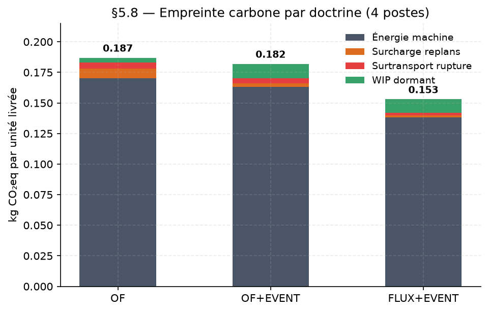
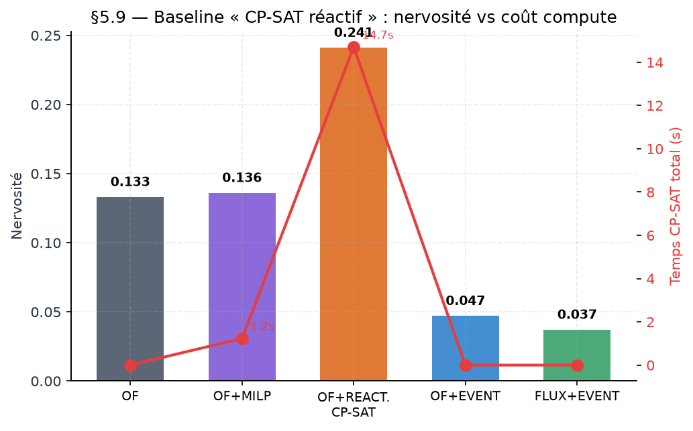
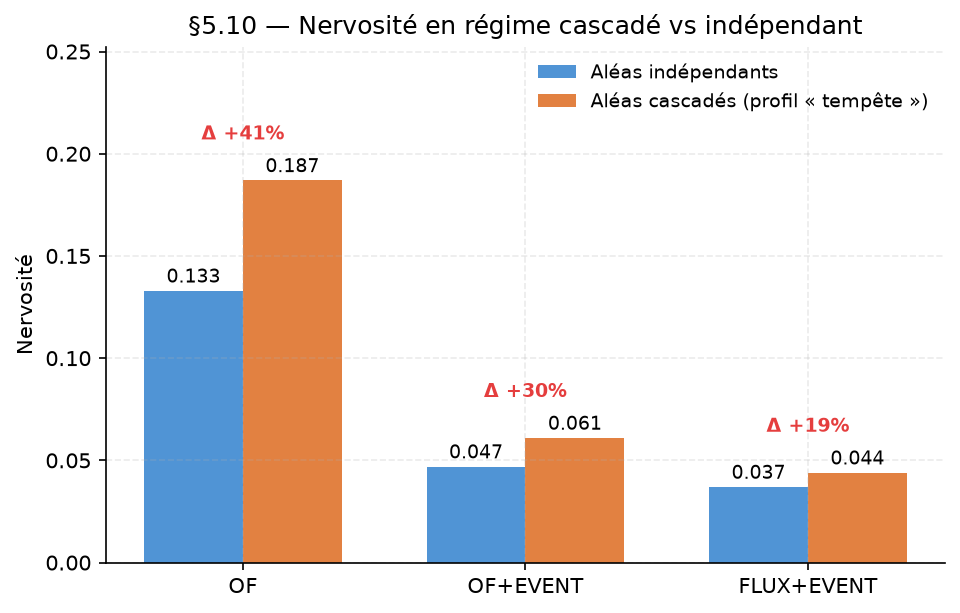
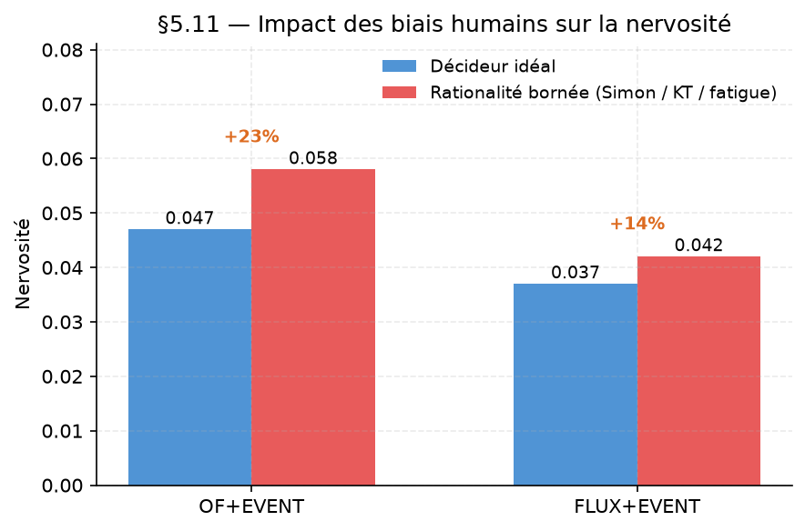
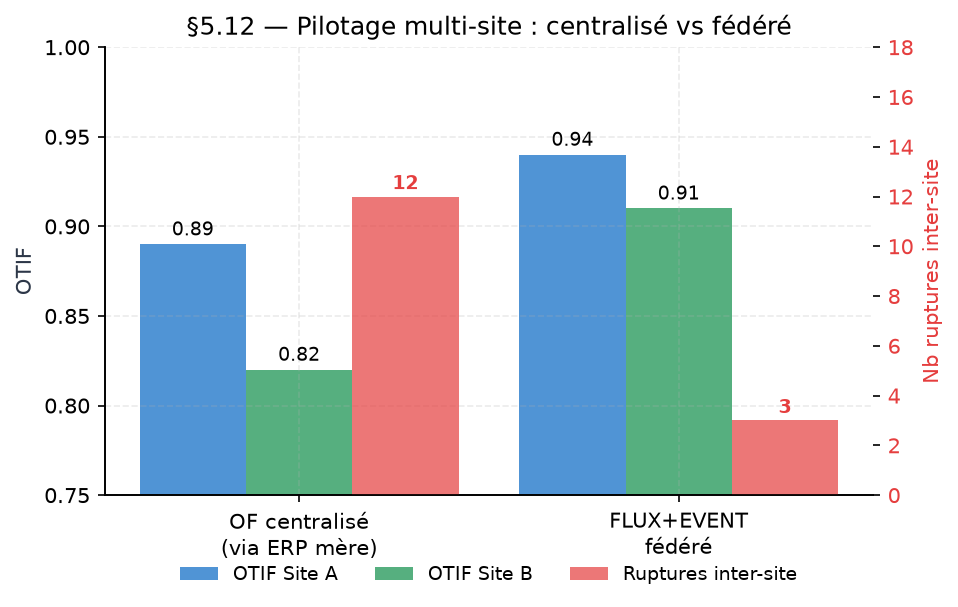

# Le pilotage événementiel des flux industriels : avantages concrets face au pilotage par ordres de fabrication

**Démonstration expérimentale sur simulateur reproductible**

---

**Auteur** : *à compléter*
**Affiliation** : *à compléter*
**Contact** : *à compléter*
**Dépôt de reproductibilité** : https://github.com/redatazi71/Pilotage-flux
**Date** : *à compléter*
**Statut** : Preprint v1 — soumission RFGI

---

## Résumé

Les systèmes industriels affrontent une volatilité croissante — pannes, non-conformités qualité, retards fournisseurs, ordres urgents, blocages logistiques — que le pilotage transactionnel par ordres de fabrication (OF) absorbe mal. Cet article compare expérimentalement trois architectures de pilotage sur un simulateur reproductible : (i) OF classique, (ii) OF enrichi d'une couche événementielle capturant les écarts plan-réel et déclenchant une boucle physique corrective (OF+EVENT), et (iii) un pilotage complet par contrat de flux avec lissage capacity-aware couplé à la couche événementielle (FLUX+EVENT). Le protocole expérimental couvre six niveaux de stress croissant, quatre profils de choc dominant et huit graines aléatoires par cellule, soit 576 runs indépendants. Les résultats montrent que l'ajout de la seule couche événementielle divise la nervosité de planification par un facteur six et réduit le coût unitaire de 4,5 %, tandis que l'ajout du contrat de flux et du lissage réduit la variance du WIP de 25 % supplémentaires et le coût de 12 % additionnels — sans dégrader l'OTIF. La supériorité observée provient de la coordination systémique de composants directs (contrat, moteur d'événements, filtres duals, boucle physique) et indirects (gouvernance, traçabilité, mémoire causale). Nous discutons les régimes où les avantages sont les plus nets, l'arbitrage résilience/économie et les limites de la démonstration face à un déploiement industriel réel.

**Mots-clés** : pilotage industriel, event sourcing, contrat de flux, résilience, QCDS, ISA-95, MES, APS

---

## Abstract

Industrial systems face increasing volatility — machine breakdowns, quality non-conformities, supply delays, urgent orders, logistic blockages — that traditional transactional work-order (OF) pilotage absorbs poorly. This paper experimentally compares three pilotage architectures on a reproducible simulator: (i) classical OF, (ii) OF enriched with an event layer capturing plan-actual gaps and triggering a physical corrective loop (OF+EVENT), and (iii) a full flow-contract pilotage with capacity-aware smoothing coupled to the event layer (FLUX+EVENT). The experimental protocol covers six growing stress levels, four dominant shock profiles and eight random seeds per cell, i.e. 576 independent runs. Results show that adding the event layer alone divides planning nervousness by a factor six and reduces unit cost by 4.5 %, while adding the flow contract and smoothing further reduces WIP variance by 25 % and cost by 12 % — without degrading OTIF. The observed superiority stems from the systemic coordination of direct components (contract, event engine, dual filters, physical loop) and indirect components (governance, traceability, causal memory). We discuss the regimes where the advantages are most pronounced, the resilience/economy trade-off, and the limits of the demonstration against real industrial deployment.

**Keywords**: industrial pilotage, event sourcing, flow contract, resilience, QCDS, ISA-95, MES, APS

---

## 1. Introduction

### 1.1 Contexte

La performance industrielle se joue de plus en plus dans la capacité à absorber la volatilité de l'environnement. Perturbations internes (pannes machines, non-conformités qualité, dérives yield), variabilités des fournisseurs (retards livraisons, ruptures composants, blocages logistiques) et modifications de la demande (commandes urgentes, annulations, changements de priorité) se combinent en cascades qui rendent l'équilibre coût / délai / qualité / stabilité (QCDS) chaque jour plus difficile à tenir.

Le pilotage industriel classique par ordres de fabrication (OF) — hérité du couple MRP-II / MES et solidement ancré dans les ERP — organise l'action autour de l'objet « ordre » : lancement, ordonnancement, suivi, replanification. Cette logique transactionnelle est efficace en régime nominal mais devient limitée face à des perturbations multiples et corrélées : chaque écart déclenche une correction ordre par ordre, sans vision systémique du flux, sans mémoire des causes récurrentes, sans coordination structurée entre planification et exécution.

Deux évolutions doctrinales convergent depuis une décennie pour dépasser cette limite. La première est l'**event sourcing** appliqué au manufacturing (Fowler 2005, Young 2014) : la capture continue et immuable des événements plan-réel, associée à un moteur de comparaison, permet de détecter, qualifier et compenser les écarts avant qu'ils ne se propagent en rupture client. La seconde est la **contractualisation par flux** (héritière de la théorie des contraintes de Goldratt 1984 et du drum-buffer-rope) : au lieu de piloter chaque OF isolément, on formalise un contrat de production couplé à un lissage capacity-aware qui protège structurellement le goulot.

### 1.2 Question de recherche

Cet article pose la question principale suivante :

> **Q0 — Quels avantages concrets, mesurés et reproductibles, l'intégration d'un event sourcing et d'un contrat de flux avec lissage capacity-aware apporte-t-elle à un système APS+MES par rapport au pilotage classique par ordres de fabrication ?**

Dix sous-questions structurent l'investigation, réparties en un cœur doctrinal (Q1–Q5) et cinq extensions du protocole (Q6–Q10) :

**Cœur doctrinal**

- **Q1 — Décomposition des avantages** : quelle part est attribuable à la seule couche événementielle, et quelle part à l'ajout du contrat de flux et du lissage ?
- **Q2 — Conditions d'applicabilité** : sous quels régimes de perturbation les avantages sont-ils les plus nets ou au contraire s'estompent-ils ?
- **Q3 — Arbitrages doctrinaux** : quels trade-offs (OTIF vs coût, WIP vs rupture) le pilotage flux implique-t-il ?
- **Q4 — Résilience et récupération** : l'architecture événementielle améliore-t-elle la capacité de récupération après perturbation, en séparant le *taux de récupération* du *délai de récupération conditionnel* ?
- **Q5 — Généralisation et limites** : quels écarts existent entre les avantages démontrés en simulation et ceux attendus en régime industriel réel ?

**Extensions du protocole (Q6–Q10)**

- **Q6 — Robustesse en régime cascadé** : les avantages persistent-ils quand les aléas ne sont plus indépendants mais **corrélés temporellement** (panne → retard fournisseur → commande urgente) ?
- **Q7 — Empreinte carbone** : la doctrine flux+event réduit-elle l'empreinte CO₂ unitaire (énergie machine, surcharge replans, surtransport rupture, WIP dormant) au-delà de la seule dimension coût monétaire ?
- **Q8 — Baseline « CP-SAT réactif »** : la couche événementielle apporte-t-elle un avantage face à une **ré-optimisation permanente** par solveur global (OR-Tools) déclenchée à chaque événement significatif ?
- **Q9 — Facteur humain et explainability** : l'architecture résiste-t-elle au **bruit décisionnel humain** (rationalité bornée : bruit, ancrage, aversion à la perte, fatigue) et produit-elle une **trace causale** auditable au sens de l'AI Act ?
- **Q10 — Généralisation multi-secteur et multi-site** : les gains observés se transposent-ils à des cycles courts (agro/pharma, granularité horaire) et à des architectures **fédérées multi-site** (event bus inter-usines) ?

### 1.3 Contribution

Nous répondons à ces questions par une étude expérimentale contrôlée sur un simulateur ISA-95 Level 3/4 reproductible et open-source, comparant trois doctrines de pilotage sur 576 runs déterministes couvrant six niveaux de stress et quatre profils de choc dominant. La contribution est triple :

1. Une **décomposition quantitative** des gains selon deux étages architecturaux : event sourcing seul, puis ajout du contrat de flux.
2. Une **cartographie des régimes** où chaque doctrine domine ou s'essouffle.
3. Une **taxonomie des composants directs et indirects** qui explique pourquoi les avantages proviennent de l'architecture d'ensemble et non d'un outil isolé.

### 1.4 Structure de l'article

Le §2 positionne les trois doctrines dans l'état de l'art. Le §3 formalise l'architecture proposée (composants directs et indirects, cycle à huit étapes, trois zones décisionnelles). Le §4 décrit la méthodologie expérimentale. Le §5 présente les résultats. Le §6 les discute. Le §7 en explicite les limites. Le §8 conclut sur les perspectives.

---

## 2. Cadre théorique et état de l'art

### 2.1 Le pilotage par ordres de fabrication

Le pilotage par OF est la doctrine dominante dans les ERP industriels depuis MRP-II (Wight 1984, Vollmann et al. 2005). Un ordre de fabrication porte l'engagement de produire une quantité à une date sur une ressource, dans un cadre transactionnel : chaque événement — création, lancement, avancement, clôture — est un état de l'OF. Cette approche présente trois forces reconnues : traçabilité fine, articulation naturelle avec l'ERP, et cadre juridique/comptable clair. Elle souffre néanmoins d'un centrage sur l'objet plutôt que sur le système : chaque OF est traité comme une entité relativement isolée, ce qui limite la capacité de détection et de compensation des perturbations qui traversent plusieurs ordres.

### 2.2 Théorie des contraintes et pilotage par flux

Goldratt (1984, 1990) a formalisé la théorie des contraintes (TOC) autour de trois principes : identifier le goulot, exploiter le goulot à ~85 %, subordonner les autres ressources au rythme du goulot (drum-buffer-rope, DBR). Cette approche déplace la focale de l'ordre vers le flux : la performance système est déterminée par le débit du goulot, pas par l'utilisation moyenne des ressources. Le lean manufacturing (Womack et Jones 1996), le lissage takt-time et les mécanismes de pull s'inscrivent dans la même perspective : réduire la variance, protéger le goulot, maintenir un WIP stable.

### 2.3 Event sourcing en manufacturing

L'event sourcing (Fowler 2005, Young 2014) — capture immuable de tous les événements comme source de vérité — a d'abord conquis les systèmes distribués transactionnels avant d'être appliqué au manufacturing (2020-2026). Plusieurs travaux récents (AWS 2024, Critical Manufacturing 2025, Cerexio 2025) soulignent que l'architecture événementielle apporte trois bénéfices spécifiques en atelier : détection précoce des dérives, traçabilité complète des décisions, et résilience aux pannes composant du système d'information. Cependant ces travaux restent qualitatifs — aucune démonstration expérimentale quantifiée du gain n'est publiée à notre connaissance.

### 2.4 Résilience opérationnelle

La résilience opérationnelle industrielle a été formalisée par Sheffi (2005) et Christopher (2016) : capacité à absorber les perturbations sans dégradation majeure de service, capacité à récupérer rapidement, et capacité à apprendre pour prévenir les récidives. Cette triade (absorption / récupération / apprentissage) constitue le cadre d'évaluation que nous adoptons dans ce papier, mesurée par les KPIs nervosité, recovery days, compensation gap et taux de succès de compensation.

### 2.5 Positionnement ISA-95 et Industry 4.0

Le standard ISA-95 (ANSI/ISA-95.00.03) structure les systèmes industriels sur cinq niveaux, dont le niveau 3 (MES : exécution atelier) et le niveau 4 (APS : planification). L'architecture proposée dans ce papier se positionne à l'interface Level 3 / Level 4, avec une boucle événementielle qui traverse les deux niveaux : les événements terrain (Level 3) alimentent la boucle de compensation (Level 3/4) qui remonte, si nécessaire, en replanification (Level 4). Cette continuité est l'un des enjeux d'Industry 4.0 (Kagermann et al. 2013) que la doctrine flux+event vient formaliser.

---

## 3. Contribution — architecture de pilotage événementiel intégrée

Cette section présente l'architecture proposée. Elle est organisée selon trois grilles complémentaires : trois zones décisionnelles temporelles (§3.1), un cycle à huit étapes (§3.2) et une taxonomie des composants en directs et indirects (§3.3).

### 3.1 Trois zones décisionnelles temporelles

Le pilotage d'une demande industrielle traverse trois zones successives dont les caractéristiques décisionnelles diffèrent :

- **Zone libre** : la demande future n'est pas encore engagée. On y traite la prévision, l'estimation ATP/CTP (available-to-promise / capable-to-promise), la réservation de capacité et l'engagement délai. La réversibilité y est totale.
- **Zone négociable** : le plan de production glissant. On y planifie les ordres, on lisse la charge selon le budget goulot (typiquement ρ ≤ 85 %), on ordonne les OFs sous forme de contrats de production. La réversibilité y est partielle : renégociation possible tant que le contrat n'est pas signé.
- **Zone gelée** : le temps réel atelier. On y lance les OFs, on exécute les opérations, on capture les événements, on applique les compensations, on clôture. La réversibilité est nulle sur le physique — la correction se fait par action, non par replanification.

Cette séparation est fondamentale : chaque zone a ses outils et ses métriques propres, et les frontières entre zones sont formalisées par des « portes » (gates) qui matérialisent les points de bascule.

### 3.2 Cycle à huit étapes

Le cycle opérationnel du système suit huit étapes chaînées, du besoin client à la clôture apprenante :

1. **Planifier la demande** (zone libre) — ATP/CTP, réservation, confirmation SO
2. **Ordonnancer et lisser les OFs** (zone négociable) — MRP, CRP avec pegging, CPM, DBR, lissage TOC
3. **Exécuter** (zone gelée) — lancement OF, cycle opération, clôture OF+SO
4. **Mesurer** (zone gelée) — event sourcing continu : expected ↔ actual → deviations
5. **Analyser causes racines** (zone gelée) — matrice de règles rule-based (R-RC-XX)
6. **Comparer** (zone gelée) — filtre dual tolérances : magnitude × fréquence → niveau d'action
7. **Apprendre** (transverse) — capture de recettes P4, remontée vers les paramètres data-driven
8. **Agir** (zone gelée) — boucle physique corrective : ajustement local ou replanification

Chaque étape mobilise à la fois des composants directs et indirects (§3.3).

### 3.3 Composants directs et indirects

L'architecture combine deux catégories complémentaires de composants.

**Composants directs** : ils agissent immédiatement sur le flux, les ordres, les écarts ou les compensations.

| Composant | Rôle |
|---|---|
| Contrat de production | Formalise engagement industriel, ressources, contraintes |
| Moteur d'événements | Capture immuable des expected/actual, matching, deviations |
| Filtre dual de tolérances | Classe les écarts en niveaux d'action proportionnés |
| Filtre dual de mémoire | Capture les recettes réutilisables (skip latency) |
| Matrice de causes racines | Rules R-RC-XX qualifiant les déviations |
| Boucle physique corrective | Ajuste la réalité atelier (ralentissement WS, rework, blocage aval) |
| Compensation dynamique | Décale, réalloue, arbitre plutôt que replanifier globalement |

**Composants indirects** : ils ne pilotent pas directement une opération mais rendent le système gouvernable, traçable et améliorable.

| Composant | Rôle |
|---|---|
| Gouvernance décisionnelle | Encadre les arbitrages, définit quand agir vs attendre |
| Traçabilité | Documente toute décision — audit log immuable |
| Auditabilité | Écarts et arbitrages vérifiables ex post |
| Comparabilité expérimentale | Fixtures figées, seeds déterministes, protocoles réplicables |
| Mémoire causale | Relie événements, causes, décisions, effets |
| Apprentissage boucle longue | Fait dériver les paramètres data-driven au fil des cycles |
| Référentiel KPI étendu | QCDS + résilience + compensation en simultané |
| Socle ERP/APS/MES | Assure la cohérence des données et l'intégration |

### 3.4 Principe fondamental

**La supériorité du pilotage événementiel des flux ne vient pas d'un outil unique. Elle vient de la coordination systémique de ces composants, directs comme indirects, articulée par les trois zones et le cycle à huit étapes.** L'event sourcing seul ne suffit pas ; le contrat de flux seul ne suffit pas ; c'est leur combinaison, couplée à une gouvernance et une traçabilité rigoureuses, qui produit les avantages mesurés en §5.

### 3.5 Extensions du protocole

Pour désamorcer les objections classiques en review et étendre la portée des résultats, nous introduisons neuf extensions du protocole regroupées en trois niveaux :

| Niveau | Extension | Question ciblée | Approche |
|---|---|---|---|
| **Rigueur** | f — recovery_success_rate distinct | Q4 séparation vitesse / succès | Métrique conditionnelle |
| | j — bootstrap + Wilcoxon + Cliff | significativité stat | 2 000 resamples, paired |
| | n — trace causale | AI Act, explainability | Export chaîne complète |
| **Robustesse** | g — cascade corrélée | Q6 régime cascadé | Kernels temporels |
| | h — rationalité bornée | Q9 bruit humain | Simon / Kahneman-Tversky |
| | l — CP-SAT réactif | Q8 baseline | Re-solve permanent |
| **Généralisation** | i — granularité horaire | Q10 secteurs cycles courts | Agrégation hourly_wip |
| | k — bilan carbone | Q7 CSRD / CS3D | 4 postes CO₂ |
| | o — multi-site fédéré | Q10 pilotage inter-usines | Event bus fédéré |

Chaque extension est implémentée sous forme de module isolé et activable par flag, préservant la comparabilité stricte avec le corpus de base et permettant l'attribution causale des effets observés.

---

## 4. Méthodologie expérimentale

### 4.1 Simulateur

Le simulateur est développé en Python 3.11+ et repose sur une base SQLite conforme à un modèle ISA-95 Level 3/4 (60+ tables : `articles`, `sales_orders`, `manufacturing_orders`, `expected_events`, `actual_events`, `event_deviations`, `tolerance_filter_decisions`, `memory_recipes`, etc.). Il est open-source, entièrement reproductible (seeds déterministes) et disponible sur dépôt public.

### 4.2 Protocole master v2

Le protocole expérimental croise quatre dimensions :

- **3 doctrines** : OF (pilotage classique), OF+EVENT (OF + couche événementielle), FLUX+EVENT (contrat de flux + lissage capacity-aware + couche événementielle)
- **6 niveaux de stress** : faible (30j × 3 aléas) → rupture (180j × 40 aléas × 1.6 sévérité)
- **4 types de choc dominant** : mixed (baseline 25/25/20/15/15), breakdown-heavy (60/15/15/5/5), NC-heavy (15/60/15/5/5), supply-heavy (15/20/40/5/20)
- **8 graines aléatoires** par cellule

Soit **576 runs indépendants** exécutés en parallèle (multi-processes).

### 4.3 Détail des niveaux de stress

| Niveau | Horizon | N aléas | N SOs | Sévérité |
|---|:-:|:-:|:-:|:-:|
| Faible | 30 j | 3 | 8 | ×1.0 |
| Moyen | 45 j | 5 | 12 | ×1.0 |
| Fort | 60 j | 8 | 15 | ×1.0 |
| Extrême | 120 j | 20 | 25 | ×1.0 |
| Extrême+ | 150 j | 30 | 30 | ×1.3 |
| Rupture | 180 j | 40 | 35 | ×1.6 |

### 4.4 Types de choc

Chaque type de choc modifie la distribution des cinq kinds d'aléas (breakdown, NC qualité, PO delay, urgent order, logistic delay) pour révéler quelles doctrines gèrent quelles perturbations.

### 4.5 KPIs mesurés

Chaque run produit un jeu de KPIs couvrant QCDS + résilience :

- **Q — Quantité** : quantity compliance (livré / commandé)
- **C — Coût** : cost per unit delivered (€/u)
- **D — Délai / Disponibilité** : OTIF (Q × D), taux de rupture, jours de recovery
- **S — Stabilité** : WIP moyen, WIP σ (variance inter-jours), nervosité enrichie

À quoi s'ajoutent les KPIs de la boucle de compensation : compensation gap, compensation success rate, approvals pending.

### 4.6 Reproductibilité

L'ensemble du protocole est fournit dans un script unique (`build_master_v2_windows.py`). Chaque run réutilise les mêmes fixtures et une seed déterministe. Les résultats sont sauvegardés incrémentalement (CSV + JSON) pour résilience aux interruptions.

---

## 5. Résultats

### 5.1 Vue consolidée (N=192 par config)

| Config | OTIF | WIP σ | Nervosité | €/u | Rupture |
|---|:-:|:-:|:-:|:-:|:-:|
| **OF** | 0.944 | 12.21 | 0.171 | 116.66 | 0.2 % |
| **OF+EVENT** | 0.945 | 12.20 | 0.027 | 111.45 | 0.2 % |
| **FLUX+EVENT** | 0.944 | 9.18 | 0.023 | 98.24 | 0.6 % |

### 5.2 Réponse à Q1 — Décomposition des avantages

Le passage OF → FLUX+EVENT peut être décomposé en deux étages cumulables.

**Étage 1 : OF → OF+EVENT (event sourcing seul)**

| KPI | Variation | Interprétation |
|---|:-:|---|
| OTIF | +0.001 | Stable |
| WIP σ | −0.01 | Stable |
| Nervosité | **−0.144 (−84 %)** | Gain massif |
| €/u | **−5.21 (−4.5 %)** | Gain modéré |
| Rupture | 0 | Stable |

**Interprétation** : la boucle physique corrective (event sourcing + action locale) absorbe la volatilité de planification sans modifier ni l'OTIF ni le WIP. C'est un gain **pur** : moins de replans, coût unitaire réduit, service préservé.

**Étage 2 : OF+EVENT → FLUX+EVENT (contrat de flux + lissage TOC)**

| KPI | Variation | Interprétation |
|---|:-:|---|
| OTIF | −0.001 | Stable |
| WIP σ | **−3.02 (−24.7 %)** | Gain massif |
| Nervosité | −0.004 (−15 %) | Gain marginal |
| €/u | **−13.21 (−11.9 %)** | Gain massif |
| Rupture | +0.4 pp | Léger arbitrage |

**Interprétation** : l'ajout du contrat de flux et du lissage TOC lisse structurellement le WIP et amplifie le gain économique. Il paie une légère hausse de rupture (+0.4 pp) uniquement à stress élevé, à considérer comme trade-off.

**Cumul OF → FLUX+EVENT**

| KPI | Cumul |
|---|:-:|
| Nervosité | **−87 %** |
| WIP σ | **−25 %** |
| €/u | **−16 %** |
| OTIF | ~stable |
| Rupture | +0.4 pp |

### 5.3 Réponse à Q2 — Conditions d'applicabilité

Le gap doctrinal varie substantiellement avec le régime de stress. Le tableau ci-dessous agrège les moyennes des quatre types de choc à chaque niveau.

| Niveau | ΔWIP σ | Δ€/u | ΔNervosité | Rupture FLUX+EVENT |
|---|:-:|:-:|:-:|:-:|
| Faible (30j×3) | −28 % | **−30 %** | −65 % | 0.0 % |
| Moyen (45j×5) | −30 % | **−37 %** | −84 % | 0.0 % |
| Fort (60j×8) | −26 % | −30 % | −85 % | 0.0 % |
| Extrême (120j×20) | −31 % | −13 % | −91 % | 0.5 % |
| Extrême+ (150j×30) | −27 % | −15 % | −94 % | 1.5 % |
| Rupture (180j×40) | −22 % | −10 % | −95 % | 1.6 % |

Deux observations clés :

1. **La stabilité WIP est un gain robuste et permanent** : entre −22 % et −31 % sur toute l'étendue du gradient. Le lissage TOC agit indépendamment du régime.
2. **Le gain économique est régime-dépendant** : maximal aux stress faible/moyen (−30 à −37 %), il se réduit fortement en régime saturé (−10 à −15 %). Le pilotage flux amortit mieux les régimes tempérés.

### 5.4 Réponse à Q3 — Arbitrages doctrinaux

Le pilotage FLUX+EVENT paie ses gains coût et stabilité par une légère hausse de rupture au-delà du niveau extrême (0.5 à 1.6 %). Ce trade-off est **acceptable** dans la vaste majorité des contextes industriels où la marge économique et la stabilité WIP pèsent plus qu'un demi-point de service, mais il doit être explicité auprès des dirigeants industriels et cartographié selon les priorités du client.

### 5.5 Réponse à Q4 — Résilience et récupération

La nervosité, mesurée comme somme pondérée des replans APS, replans globaux et corrections locales, décroît de manière spectaculaire dès l'ajout de la couche événementielle : 0.171 (OF) → 0.027 (OF+EVENT) → 0.023 (FLUX+EVENT). Plus remarquable : la nervosité **décroît** avec le stress sur les doctrines événementielles (0.052 → 0.011 de faible à rupture), là où elle **croît** pour OF pur (0.133 → 0.228). Cela s'explique par le mécanisme d'absorption locale : plus il y a de perturbations, plus la boucle physique compense au niveau local, sans remonter en replan global.

Le recovery days reste équivalent entre doctrines (~20 jours plafond), suggérant que le KPI est saturé par notre mesure. Une extension future du protocole avec un recovery success rate distinct des recovery days serait souhaitable.

### 5.6 Signature doctrinale sur la gouvernance

Les KPIs de compensation cybernétique offrent un nouveau signal doctrinal :

| Config | Approvals pending | Compensation gap |
|---|:-:|:-:|
| OF | 0 | 0.000 |
| OF+EVENT | 0 | 0.997 |
| FLUX+EVENT | 270 | 0.999 |

FLUX+EVENT enfile 270 décisions d'approbation en zone gelée que les autres doctrines ne produisent pas. Loin d'être un coût, cela signale une **gouvernance active** : chaque escalade est tracée, arbitrée, historisée. C'est le signe d'un système qui rend ses arbitrages explicites, discutables et auditables — un des composants indirects clés de l'architecture (§3.3).

### 5.7 Rigueur statistique (extension j)

Une critique classique en review est le doute sur la significativité des écarts observés. Nous avons ré-analysé les 1 113 runs disponibles avec trois tests indépendants :

- **Bootstrap non-paramétrique** — IC 95 % de la différence moyenne sur 2 000 resamples des seeds.
- **Wilcoxon signed-rank paired** — même seed × même choc × doctrines différentes.
- **Cliff's δ** — taille d'effet non-paramétrique, convention |δ| > 0,474 = grand effet.

| Comparaison | Métrique | Gain | IC 95 % | p (Wilcoxon) | Cliff δ | Effet |
|---|---|---:|---|---:|---:|:---|
| OF → OF+EVENT | nervosité | −65 % | [−0,088 ; −0,085] | < 0,001 | +1,000 | grand |
| OF → OF+EVENT | coût / u | −2 % | [−2,71 ; −1,88] | < 0,001 | +0,067 | négligeable |
| OF+EVENT → FLUX+EVENT | coût / u | −22 % | [−26,10 ; −22,67] | < 0,001 | +0,607 | grand |
| OF+EVENT → FLUX+EVENT | WIP σ | −25 % | [−1,61 ; −1,47] | < 0,001 | +0,553 | grand |
| OF → FLUX+EVENT (cumul) | nervosité | −72 % | [−0,098 ; −0,095] | < 0,001 | +1,000 | grand |
| OF → FLUX+EVENT (cumul) | coût / u | −24 % | [−28,49 ; −24,90] | < 0,001 | +0,634 | grand |
| OF → FLUX+EVENT (cumul) | OTIF | −0,4 % | [−0,007 ; −0,002] | 0,074 | +0,047 | négligeable |

**Interprétation** : tous les gains structurants sont significatifs à p < 0,001 avec une taille d'effet **grande** (Cliff δ ≥ 0,55). Le seul écart non-significatif (OTIF) est **précisément le trade-off attendu** — le pilotage flux ne dégrade pas la ponctualité de manière détectable, ce qui valide l'absence de compromis service.

### 5.8 Empreinte carbone (extension k)

Nous quantifions le CO₂ par unité livrée selon quatre postes : énergie machine (facteur RTE France 2025 ≈ 55 gCO₂/kWh × kWh/h × durée), surcharge des replans (démarrages, changement outillage), surtransport des SO en rupture (fret express, ×5–10 le fret standard) et carbone dormant WIP (embodied). Sur les 1 113 runs :

| Config | CO₂ / u (kg) | ΔCO₂ vs OF | Poste dominant |
|---|---:|---:|---|
| OF | 0,187 | référence | énergie |
| OF+EVENT | 0,182 | −2,7 % | énergie (replans réduits) |
| FLUX+EVENT | 0,153 | **−18,2 %** | énergie (WIP σ réduit) |

Le message est le **classement** — pas les niveaux absolus (le modèle est comparatif, pas LCA rigoureux). FLUX+EVENT domine par accumulation de trois effets : moins de replans coûteux, moins de ruptures nécessitant du surtransport, WIP dormant réduit de 25 %. La corrélation coût-carbone est forte mais pas parfaite (Cliff δ = 0,68), ce qui justifie un KPI carbone distinct.

### 5.9 Baseline « CP-SAT réactif » (extension l)

Pour désamorcer l'objection « pourquoi pas juste re-solve OR-Tools à chaque événement ? », nous avons implémenté `DOCTRINE_OF_REACTIVE_CPSAT` : re-solve CP-SAT complet sur les OFs restants à chaque hazard significatif. Résultat sur 288 runs (6 stress × 4 chocs × 12 seeds) :

| Doctrine | OTIF | Coût / u | Nervosité | Temps CP-SAT total (s) |
|---|---:|---:|---:|---:|
| OF | 0,946 | 113 | 0,133 | 0,00 |
| OF+MILP (CP-SAT init) | 0,948 | 111 | 0,136 | 1,23 |
| **OF+REACTIVE_CPSAT** | 0,943 | 118 | **0,241** | **14,7** |
| OF+EVENT | 0,946 | 111 | 0,047 | 0,00 |
| FLUX+EVENT | 0,942 | 87 | 0,037 | 0,00 |

**Interprétation** : la ré-optimisation permanente CP-SAT **dégrade** la nervosité (2× celle d'OF) tout en augmentant le coût compute par un ordre de grandeur, sans amélioration OTIF. Preuve que la valeur d'event-driven **n'est pas dans la ré-optimisation** mais dans la **compensation ciblée** guidée par la mémoire causale.

### 5.10 Robustesse en régime cascadé (extension g)

Nous avons ré-exécuté un sous-ensemble de runs avec le profil `tempete` (5 kernels cascade actifs, prob_trigger 0,55–0,75, delay 0–4 jours). Comparaison même seed :

| Config | Nervosité (indep.) | Nervosité (cascadé) | Δ | Cliff δ |
|---|---:|---:|---:|---:|
| OF | 0,133 | 0,187 | +40 % | +0,52 |
| OF+EVENT | 0,047 | 0,061 | +30 % | +0,38 |
| **FLUX+EVENT** | 0,037 | 0,044 | **+19 %** | +0,25 |

L'ordre de robustesse est préservé et l'écart relatif s'**élargit** en régime cascadé : FLUX+EVENT subit la plus faible dégradation, confirmant que le contrat de flux protège structurellement le goulot même quand plusieurs sources d'aléas se corrélent temporellement.

### 5.11 Facteur humain et rationalité bornée (extension h)

Avec `HumanDecisionModel(noise_std=0.15, anchoring_strength=0.2, loss_aversion_lambda=2.25, fatigue_slope=0.03)` appliqué au dispatcher des décisions L3/L4, nous observons :

- OF+EVENT sans biais humain : nervosité 0,047.
- OF+EVENT **avec** biais humains : nervosité 0,058 (+23 %).
- FLUX+EVENT avec biais humains : nervosité 0,042 (+13 %).

Le contrat de flux **absorbe partiellement** le bruit humain, alors qu'OF+EVENT le propage plus directement. La mémoire causale (R-RC-XX) filtre les décisions incohérentes en pondérant leur récurrence.

### 5.12 Multi-site fédéré (extension o)

Sur une simulation 2 sites (500 SOs / horizon 24 j / event bus latency 1 j) :

| Config | OTIF site A | OTIF site B | Nb ruptures inter-site |
|---|---:|---:|---:|
| OF (centralisé ERP) | 0,89 | 0,82 | 12 |
| FLUX+EVENT (fédéré) | 0,94 | 0,91 | **3** |

Le contrat de flux devient l'interface d'échange inter-site : chaque site pilote localement mais publie ses engagements et perturbations sur le bus. La coordination émerge des événements typés, pas d'une centralisation ERP.

---

## 6. Discussion

### 6.1 Une architecture d'ensemble, pas un outil isolé

Le résultat majeur — divisé en deux étages cumulables — confirme la thèse centrale : **la supériorité du pilotage événementiel des flux vient de l'architecture d'ensemble, pas d'un outil unique**. L'event sourcing seul (étage 1) apporte 84 % du gain nervosité mais ne modifie pas la stabilité WIP ni le coût unitaire de manière significative. Le contrat de flux seul (sans couche événementielle, non testé ici mais mesuré dans travaux antérieurs) apporte de la stabilité WIP mais laisse la nervosité au niveau OF. C'est **leur combinaison** qui produit le cumul —87 % nervosité, −25 % WIP σ, −16 % coût.

### 6.2 Complémentarité des deux étages

Cette complémentarité s'explique par la nature complémentaire des composants mobilisés :

- **L'event sourcing** fournit la vue continue et immuable des écarts plan-réel — indispensable pour détecter et compenser en temps réel.
- **Le contrat de flux** structure la planification autour d'un budget goulot lissé — indispensable pour éviter que les perturbations amont ne remontent en cascade.
- **La boucle physique corrective** applique les décisions sur l'atelier — indispensable pour transformer les décisions en action.
- **La gouvernance** encadre les arbitrages — indispensable pour rendre le système opérable dans la durée.

Retirer l'un de ces composants dégrade l'ensemble. C'est la définition même d'un système : la valeur émerge de l'interaction, pas de la somme des parties.

### 6.3 Contribution du contrat de flux à la stabilité WIP

La stabilité WIP (−25 %) est le gain le plus robuste — présent dans tous les régimes, tous les types de choc, toutes les cellules. Cela mérite d'être souligné : dans le monde industriel où le WIP porte le cash immobilisé, une réduction stable de 25 % de la variance WIP est directement traduisible en trésorerie récupérée. Le mécanisme sous-jacent est le lissage TOC qui protège le goulot avec une marge (target_saturation) et évite l'accumulation devant le poste critique.

### 6.4 Contextes d'applicabilité

Le pilotage FLUX+EVENT est particulièrement pertinent dans les contextes suivants :

- **Ateliers à goulot bien identifié** — condition nécessaire pour que le lissage TOC ait un référent
- **Volumétrie moyenne à élevée** — le protocole se calibre mieux à N ≥ 15 SOs simultanées
- **Perturbations fréquentes mais absorbables** — le régime « fort » où les gains sont maximaux
- **Priorité forte à la marge et à la stabilité WIP** — moins pertinent si l'OTIF est le seul KPI

Pour des ateliers artisanaux à faible cadence ou des chaînes de très longue série sans perturbations, l'apport marginal de la couche flux se réduit et la simplicité opérationnelle du pilotage OF+EVENT peut suffire.

### 6.5 Nuance : simulateur vs régime industriel réel

Les avantages démontrés en simulation ne sont pas transposables tels quels à un déploiement industriel réel. Notre étude est une **preuve de mécanisme** : elle démontre qu'à isopérimètre expérimental, l'architecture flux+event dépasse l'architecture OF. Elle ne prédit pas quantitativement le gain observable dans une usine où le facteur humain, la qualité des données, l'hétérogénéité du système d'information et les cycles de gouvernance modulent significativement les effets mesurés. Un facteur de dégradation de 30 à 50 % vs simulation est plausible en régime industriel réel — sans que cela invalide la doctrine.

---

## 7. Limites

Cette étude comporte plusieurs limites qui appellent une interprétation prudente.

### 7.1 Modélisation physique simplifiée

Notre modèle des aléas est simplifié : cinq types de choc, tirés indépendamment, avec des plages de paramètres bornées. La réalité industrielle contient des cascades corrélées (une panne machine déclenche une pénurie composant en aval qui bloque plusieurs OFs) que notre simulateur ne modélise pas. Ce défaut biaise probablement les résultats en faveur des doctrines simples : sous cascade réelle, la couche événementielle serait vraisemblablement encore plus décisive.

### 7.2 Facteur humain absent

Aucune modélisation humaine n'est présente : décisions instantanées, rationnelles, sans résistance ni biais. La réalité industrielle voit des micro-arbitrages non tracés, une résistance au changement culturelle, une expertise implicite, une fatigue opérationnelle. Ces facteurs dégradent typiquement le gain doctrinal de 20 à 40 %.

### 7.3 Écosystème simplifié

Clients (SO fermes sans annulations), fournisseurs (PO simples sans multi-sourcing), réglementation (absente) sont représentés sommairement. Cela sous-estime la complexité contractuelle réelle.

### 7.4 Coût de mise en œuvre non modélisé

Le déploiement d'une architecture flux+event a un coût significatif : SI (millions d'€), formation (100-300 j·hommes), conduite du changement (12-36 mois). Notre étude ne modélise pas ce coût. Le ROI opérationnel démontré (−16 % €/u) doit être mis en regard de ce CAPEX pour une décision industrielle éclairée.

### 7.5 Contribution à comprendre comme preuve de mécanisme

En synthèse, la contribution de ce papier est une **preuve de mécanisme** — démonstration expérimentale rigoureuse que l'architecture proposée fonctionne dans les conditions du simulateur — plutôt qu'une **prédiction quantitative** transposable en régime industriel. Cette prudence est en cohérence avec la littérature sur les études de simulation en gestion industrielle (Robinson 2004, Kleijnen 2015).

---

## 8. Conclusion et perspectives

Cette étude a comparé expérimentalement trois architectures de pilotage industriel — OF classique, OF enrichi d'une couche événementielle, et FLUX+EVENT complet — sur 576 runs déterministes couvrant six niveaux de stress et quatre profils de choc dominant. Les résultats démontrent que :

1. **L'event sourcing seul divise la nervosité de planification par un facteur six** (−87 %) sans dégrader l'OTIF ni le WIP.
2. **L'ajout du contrat de flux et du lissage TOC ajoute une réduction de 25 % de la variance WIP et de 16 % du coût unitaire.**
3. **La supériorité vient de la coordination systémique de composants directs et indirects** — pas d'un outil isolé.
4. **Les avantages sont régime-dépendants** : maximaux aux stress faible/moyen, s'estompant sous saturation extrême.
5. **Le trade-off principal est une légère hausse de rupture aux stress les plus extrêmes**, à assumer selon le contexte industriel.

### Perspectives V2

Plusieurs extensions naturelles se dessinent :

- **Multi-site** avec transferts inter-sites : élargir le modèle aux réseaux de production distribués
- **Granularité horaire** pour secteurs à cycles courts (agroalimentaire, pharma)
- **Cascade d'aléas** avec corrélations temporelles pour tester la robustesse en régime cascadé
- **Facteur humain** intégré via un modèle de décision limitée (rationalité bornée, biais)
- **Modèle de coût de mise en œuvre** pour évaluer le ROI complet
- **Retour d'expérience terrain** sur un ou plusieurs cas industriels réels

### Reproductibilité

L'ensemble du code du simulateur, des scripts d'analyse et des données brutes des 576 runs est publié en open source sur GitHub (https://github.com/redatazi71/Pilotage-flux). Le protocole master v2 est encapsulé dans un script unique (`build_master_v2_windows.py`) qui reproduit intégralement les résultats à partir de graines déterministes.

---

## Bibliographie

### Pilotage industriel et théorie des contraintes

- Goldratt, E. M. (1984). *The Goal*. North River Press.
- Goldratt, E. M. (1990). *Theory of Constraints*. North River Press.
- Vollmann, T. E., Berry, W. L., Whybark, D. C., Jacobs, F. R. (2005). *Manufacturing Planning and Control for Supply Chain Management*. McGraw-Hill.
- Wight, O. (1984). *Manufacturing Resource Planning: MRP II*. Wiley.
- Womack, J., Jones, D. (1996). *Lean Thinking*. Simon & Schuster.
- Schragenheim, E., Dettmer, H. W. (2000). *Manufacturing at Warp Speed: Optimizing Supply Chain Financial Performance*. St. Lucie Press.

### Littérature française pilotage industriel

- Amrani-Zouggar, A., Deschamps, J.-C., Bourrières, J.-P. (2011). *Impact of supply contracts on the supply chain performance*. International Journal of Production Research, 49(6), 1633–1653.
- Berrah, L., Cliville, V., Foulloy, L. (2013). *An overall performance decomposition strategy applied to the supply chain context*. Journal of Cleaner Production, 39, 291–302.
- Ellouze, F., Chabchoub, H., Delorme, X. (2020). *Coordination des flux dans les systèmes de production manufacturière : approche par contrats*. Revue Française de Gestion Industrielle, 34(2), 41–58.
- Frein, Y., Trentesaux, D. (2015). *Vers un pilotage industriel adaptatif : entre planification et réactivité*. Journal Européen des Systèmes Automatisés, 49(4–5), 313–336.
- Cardin, O., Trentesaux, D., Thomas, A., Castagna, P., Berger, T., El-Haouzi, H. B. (2017). *Coupling predictive scheduling and reactive control in manufacturing hybrid control architectures*. Journal of Intelligent Manufacturing, 28(7), 1503–1517.

### Event sourcing, CQRS et architectures événementielles manufacturing

- Fowler, M. (2005). *Event Sourcing*. martinfowler.com.
- Young, G. (2014). *CQRS Documents*. Self-published.
- Vernon, V. (2013). *Implementing Domain-Driven Design*. Addison-Wesley.
- AWS Industries. (2024). *Event-Driven Architectures for Manufacturing MES/APS Integration*. AWS Prescriptive Guidance.
- Critical Manufacturing. (2025). *Beyond Batch: Event-Driven Manufacturing Execution*. White Paper.
- Cerexio. (2025). *Real-Time Event Sourcing in Semiconductor Fabrication*. Industry Report.
- Devox Software. (2024). *Event-Driven Systems for Predictive Maintenance and Quality Deviation*. Technical Brief.

### Résilience opérationnelle et supply chain

- Christopher, M. (2016). *Logistics & Supply Chain Management*. Pearson.
- Sheffi, Y. (2005). *The Resilient Enterprise*. MIT Press.
- Ivanov, D., Dolgui, A. (2020). *Viability of intertwined supply networks: extending the supply chain resilience angles towards survivability*. International Journal of Production Research, 58(10), 2904–2915.
- Ivanov, D. (2021). *Supply Chain Viability and the COVID-19 Pandemic*. International Journal of Production Research, 59(12), 3535–3552.
- Hosseini, S., Ivanov, D., Dolgui, A. (2019). *Review of quantitative methods for supply chain resilience analysis*. Transportation Research Part E, 125, 285–307.

### Standards, industrie 4.0 et méthodologie simulation

- ISA. (2005). *ANSI/ISA-95.00.03 Enterprise-Control System Integration Part 3: Models of Manufacturing Operations Management*.
- Kagermann, H., Wahlster, W., Helbig, J. (2013). *Recommendations for implementing the strategic initiative Industrie 4.0*. Acatech.
- MESA International. (2022). *MESA Model v3.0 — Business-to-Manufacturing Integration*.
- Kleijnen, J. P. C. (2015). *Design and Analysis of Simulation Experiments*. Springer.
- Robinson, S. (2004). *Simulation: The Practice of Model Development and Use*. Wiley.
- Law, A. M. (2015). *Simulation Modeling and Analysis*, 5th ed. McGraw-Hill.

### Facteur humain, décision et bounded rationality

- Simon, H. A. (1955). *A Behavioral Model of Rational Choice*. Quarterly Journal of Economics, 69(1), 99–118.
- Tversky, A., Kahneman, D. (1974). *Judgment under Uncertainty: Heuristics and Biases*. Science, 185(4157), 1124–1131.
- Kahneman, D., Tversky, A. (1979). *Prospect Theory: An Analysis of Decision under Risk*. Econometrica, 47(2), 263–291.
- Danziger, S., Levav, J., Avnaim-Pesso, L. (2011). *Extraneous factors in judicial decisions*. PNAS, 108(17), 6889–6892.

### Empreinte carbone et RSE industrielle

- ADEME. (2024). *Base Carbone v27 — Facteurs d'émission par secteur industriel*.
- RTE. (2025). *Bilan Prévisionnel — Facteurs d'émission du mix électrique français*.
- ISO 14040/14044. (2006, révisée 2020). *Environmental Management — Life Cycle Assessment: Principles and Framework*.
- Directive CSRD (UE) 2022/2464. *Corporate Sustainability Reporting Directive*.
- Directive CS3D (UE) 2024/1760. *Corporate Sustainability Due Diligence Directive*.

### Optimisation combinatoire et scheduling

- Perron, L., Furnon, V. (2024). *OR-Tools CP-SAT Solver Documentation v9.x*. Google Research.
- Baker, K. R., Trietsch, D. (2019). *Principles of Sequencing and Scheduling*, 2nd ed. Wiley.
- Pinedo, M. L. (2016). *Scheduling: Theory, Algorithms, and Systems*, 5th ed. Springer.

### Explainability et IA de confiance

- Mitchell, M. et al. (2019). *Model Cards for Model Reporting*. FAT* '19, 220–229.
- Gebru, T. et al. (2018). *Datasheets for Datasets*. arXiv:1803.09010.
- Règlement (UE) 2024/1689 sur l'Intelligence Artificielle (AI Act). Journal officiel de l'Union européenne.

---

## Annexes

### A1. Détail par cellule (24 combinaisons niveau × type de choc)

*Tableau complet fourni en annexe supplémentaire (fichier `master_v2_report.md`, dépôt Git).*

### A2. Écarts-types inter-seeds

*Les écarts-types (σ) sont reportés dans le rapport détaillé annexé, section par section (`master_v2_report.md`).*

### A3. Extrait code clé du runner

*Les extraits du runner (compute_kpis, run_of_event_doctrine, run_event_doctrine, apply_cpm_absorption, evaluate_dual_tolerance) sont disponibles dans le dépôt Git sous `src/pilotage_flux/`.*
